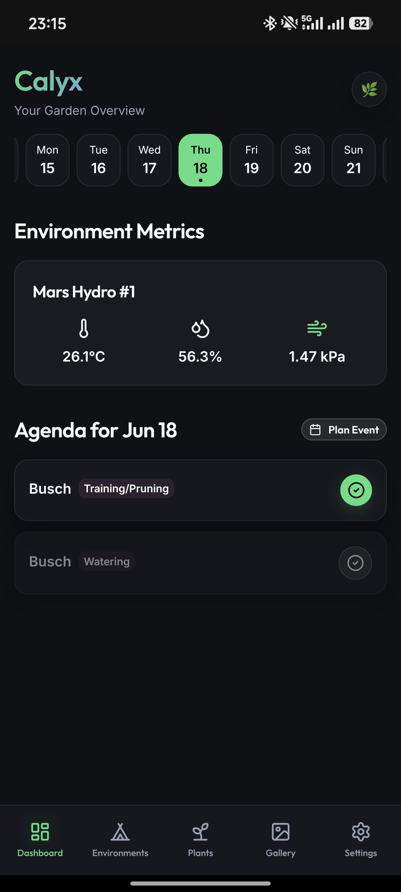
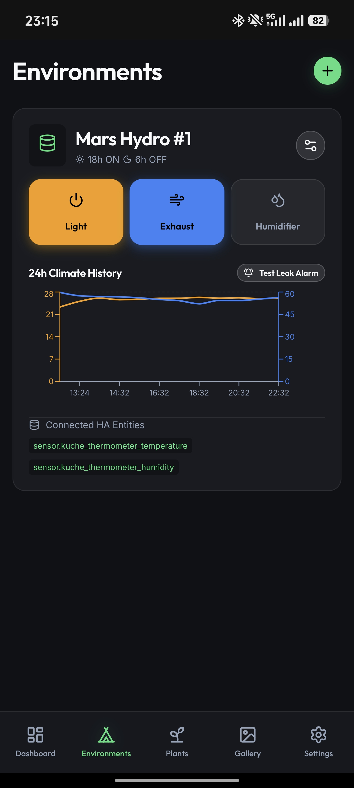
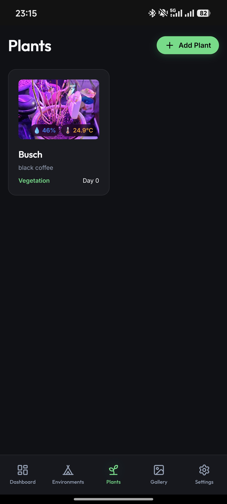

<!-- Replace with actual logo -->
<p align="center">
  
</p>


# Calyx

<p align="center">
  
  
  
</p>


Calyx tracks indoor garden environments, plant schedules, and hardware. Commercial alternatives lock features behind cloud subscriptions and isolate data from local smart devices. Calyx stores its 30,000-strain database entirely offline and integrates directly with Home Assistant to control grow room sockets without a monthly fee.

## Environment and hardware control

The application queries the Home Assistant REST API to display temperature, relative humidity, and Vapor Pressure Deficit (VPD). Users toggle smart sockets directly from the application interface. Calyx also monitors for light bleed during scheduled dark periods and pushes an alert through `ntfy` if it detects illumination.

## Plant and tent management

Users define physical grow tents and assign plants to them. The application references an offline database of 30,000 strains. When a user logs a plant, an automatic calculator uses the strain genetics to determine the optimal harvest window. Growers document visual progress by capturing and attaching photos to individual plant records.

## Feeding and scheduling

The calendar interface renders a 61-day window. Users record precise watering events, nutrition applications, and plant training tasks. The application provides a nutrient solution recipe database to store and replicate feeding mixtures. A soil moisture reading below 30% places a watering indicator on the calendar.

## Architecture

The frontend requires React 19 and Vite. Capacitor packages the web code into an Android application. The codebase relies on Zustand for state management and React Router for view navigation.

## Build instructions

Install the dependencies:
```bash
npm install
```

Start the development server:
```bash
npm run dev
```

Build the web assets and synchronize them to the Android project:
```bash
npm run build
npx cap sync android
```
